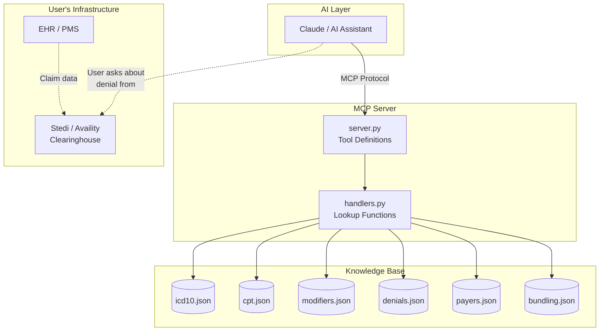
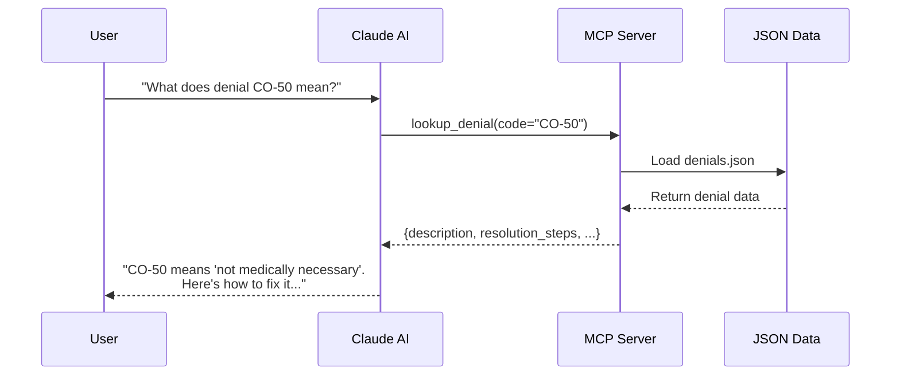
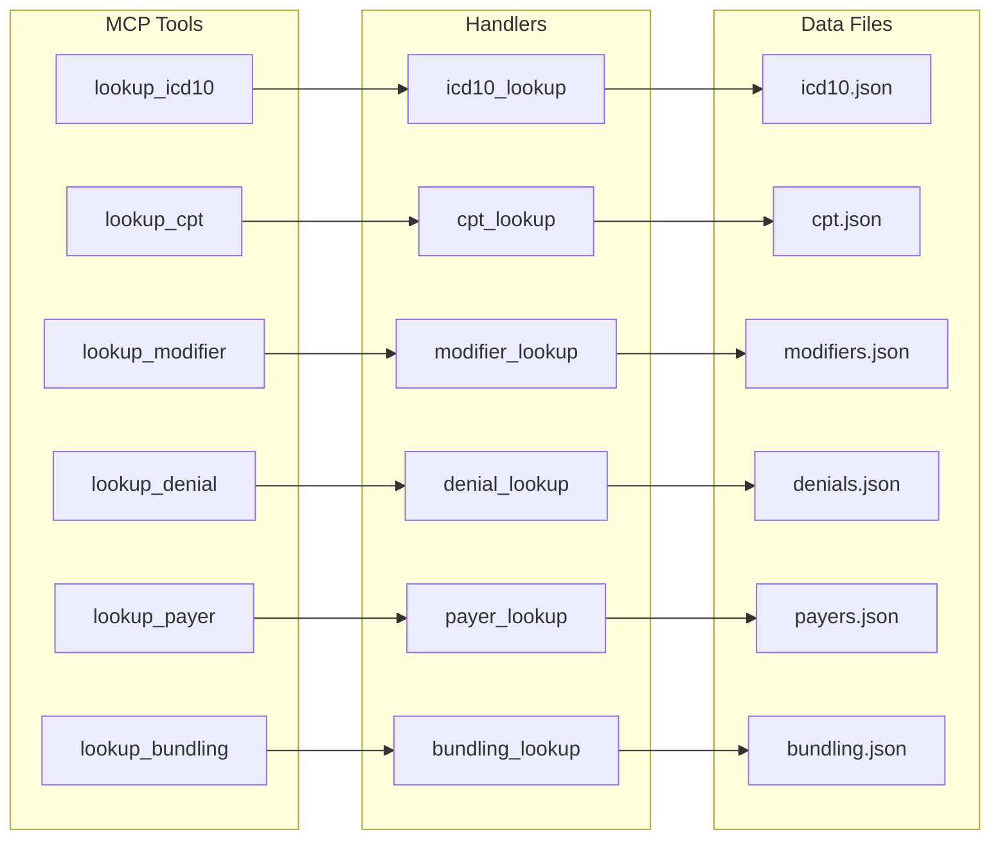
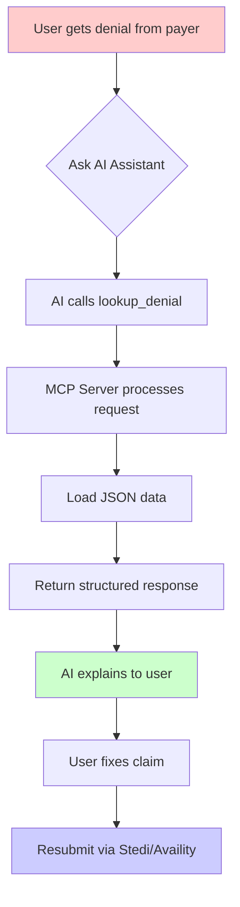
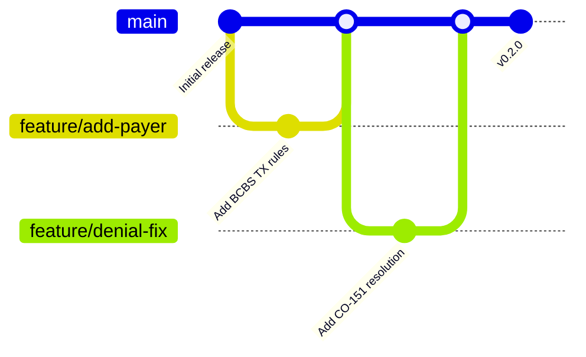
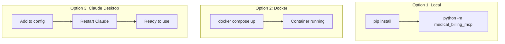

# Architecture Diagrams

## System Overview

```mermaid
graph TB
    subgraph "AI Layer"
        A[Claude / AI Assistant]
    end
    
    subgraph "MCP Server"
        B[server.py<br/>Tool Definitions]
        C[handlers.py<br/>Lookup Functions]
    end
    
    subgraph "Knowledge Base"
        D[(icd10.json)]
        E[(cpt.json)]
        F[(modifiers.json)]
        G[(denials.json)]
        H[(payers.json)]
        I[(bundling.json)]
    end
    
    subgraph "User's Infrastructure"
        J[Stedi / Availity<br/>Clearinghouse]
        K[EHR / PMS]
    end
    
    A -->|MCP Protocol| B
    B --> C
    C --> D
    C --> E
    C --> F
    C --> G
    C --> H
    C --> I
    
    A -.->|"User asks about<br/>denial from"| J
    K -.->|"Claim data"| J
```

## Request Flow

```mermaid
sequenceDiagram
    participant User
    participant Claude as Claude AI
    participant MCP as MCP Server
    participant Data as JSON Data
    
    User->>Claude: "What does denial CO-50 mean?"
    Claude->>MCP: lookup_denial(code="CO-50")
    MCP->>Data: Load denials.json
    Data-->>MCP: Return denial data
    MCP-->>Claude: {description, resolution_steps, ...}
    Claude-->>User: "CO-50 means 'not medically necessary'.<br/>Here's how to fix it..."
```

## Tool Architecture

```mermaid
graph LR
    subgraph "MCP Tools"
        T1[lookup_icd10]
        T2[lookup_cpt]
        T3[lookup_modifier]
        T4[lookup_denial]
        T5[lookup_payer]
        T6[lookup_bundling]
    end
    
    subgraph "Handlers"
        H1[icd10_lookup]
        H2[cpt_lookup]
        H3[modifier_lookup]
        H4[denial_lookup]
        H5[payer_lookup]
        H6[bundling_lookup]
    end
    
    subgraph "Data Files"
        D1[icd10.json]
        D2[cpt.json]
        D3[modifiers.json]
        D4[denials.json]
        D5[payers.json]
        D6[bundling.json]
    end
    
    T1 --> H1 --> D1
    T2 --> H2 --> D2
    T3 --> H3 --> D3
    T4 --> H4 --> D4
    T5 --> H5 --> D5
    T6 --> H6 --> D6
```

## Data Flow

```mermaid
flowchart TD
    A[User gets denial from payer] --> B{Ask AI Assistant}
    B --> C[AI calls lookup_denial]
    C --> D[MCP Server processes request]
    D --> E[Load JSON data]
    E --> F[Return structured response]
    F --> G[AI explains to user]
    G --> H[User fixes claim]
    H --> I[Resubmit via Stedi/Availity]
    
    style A fill:#ffcccc
    style G fill:#ccffcc
    style I fill:#ccccff
```

## Contribution Flow

```mermaid
gitGraph
    commit id: "Initial release"
    branch feature/add-payer
    commit id: "Add BCBS TX rules"
    checkout main
    merge feature/add-payer
    branch feature/denial-fix
    commit id: "Add CO-151 resolution"
    checkout main
    merge feature/denial-fix
    commit id: "v0.2.0"
```

## Deployment Options

```mermaid
graph TB
    subgraph "Option 1: Local"
        L1[pip install] --> L2[python -m medical_billing_mcp]
    end
    
    subgraph "Option 2: Docker"
        D1[docker compose up] --> D2[Container running]
    end
    
    subgraph "Option 3: Claude Desktop"
        C1[Add to config] --> C2[Restart Claude] --> C3[Ready to use]
    end
```
